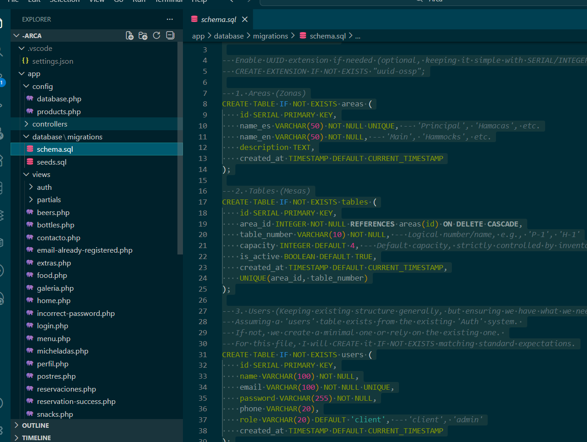
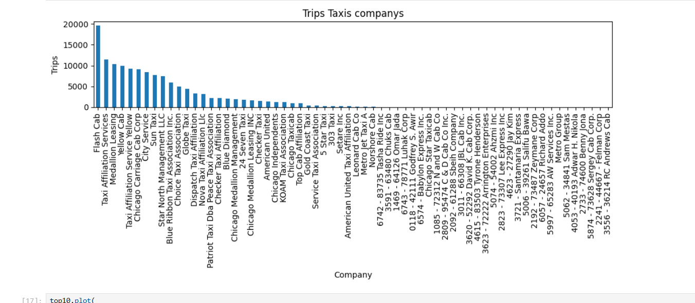

<h1 style="color:#0969da; font-size:36px; margin-bottom:0;">
Carlos Orlando Meneses Corona
</h1>

<b>Data Analyst Jr | Technical Operations | SQL · Python · BI</b>

Analista de Datos con formación en Ingeniería TIC y experiencia en análisis de datos,
automatización, SQL, BI y procesos operativos orientados a la toma de decisiones.

## **Proyectos**

### **Web Scraping y Despliegue en la Nube**

**Descripción del proyecto**  
Desarrollé un pipeline de extracción automática de datos desde una fuente HTML pública para generar un dataset limpio y listo para análisis. El objetivo fue transformar datos no estructurados en información accesible y reutilizable mediante un proceso reproducible y desplegado en la nube.

**Qué hice**
- Extracción de datos HTML usando Requests y BeautifulSoup.
- Limpieza y estructuración del dataset con Python.
- Generación de visualizaciones iniciales para exploración de datos.
- Despliegue de la solución como aplicación web ligera para consulta de resultados.

**Tecnologías utilizadas**  
Python · Requests · BeautifulSoup · Pandas · Matplotlib · Git · Render

**Resultado / impacto**

  

- <u>Automatización de la obtención de datos</u> sin intervención manual.  
- <u>Creación de un dataset reutilizable</u> para análisis posteriores.  
- <u>Disponibilidad pública del proceso</u> mediante una aplicación desplegada.

**Aprendizajes clave**
- Manejo de datos no estructurados desde HTML.
- Construcción de pipelines simples de datos (extracción → limpieza → salida).
- Flujo completo de desarrollo y despliegue (código versionado + aplicación online).

**Evidencia y código**  
Repositorio del proyecto:  
https://github.com/OrlandoCorona/App_Web_Streamlit

---

### **Sistema Web “El Arca” – Gestión Operativa e Inventarios**

Proyecto de refactor y profesionalización de un sistema interno para la operación de un restaurante real.

**Problema a resolver**
- Inconsistencias en inventarios.  
- Poca trazabilidad de ventas y consumo.  
- Dependencia de registros manuales.

**Solución implementada**
- Diseño de base de datos relacional para centralizar la operación.
- Migración de MySQL a PostgreSQL para mejorar integridad y consultas.
- Refactor del backend en PHP con estructura modular.
- Separación entre lógica de negocio, vistas y acceso a datos.
- Preparación de despliegue con Docker y pruebas en la nube.

**Impacto**
- <u>Mejor planeación de compras</u> basada en datos reales de consumo.  
- <u>Reducción de errores manuales</u> en inventarios.  
- <u>Base preparada para futuros análisis y dashboards</u>.

**Tecnologías utilizadas**  
PHP · PostgreSQL · SQL · Docker · Render · Git · HTML · CSS

**Evidencias**

  

  

**Código fuente**  
https://github.com/OrlandoCorona/ElArca-System

---

### **Zuber – Análisis de Movilidad y Estadística**

Análisis de datos de movilidad urbana para evaluar si las condiciones climáticas influyen en la duración de los viajes.

**Qué hice**
- Extracción y unión de datos con consultas SQL.
- Limpieza y preparación de datos con Pandas.
- Análisis exploratorio y visualización de tendencias.
- Pruebas estadísticas para validar hipótesis.

**Tecnologías utilizadas**  
SQL · Python (Pandas, SciPy, Matplotlib) · Jupyter Notebook

**Resultado**
Se encontraron diferencias significativas en la duración promedio de los viajes bajo distintas condiciones climáticas, mostrando que factores externos influyen en el comportamiento de los usuarios.

**Evidencias**

  

  

- <u>Pipeline completo desde SQL hasta estadística</u>.  
- <u>Validación de hipótesis con métodos estadísticos</u>.  
- <u>Generación de insights accionables</u> para operación.

**Código y análisis completo**  
https://github.com/OrlandoCorona/Zuber-Data-Analysis

---

## **Tecnologías**

Python · SQL · PostgreSQL · Power BI · ETL · Web Scraping · Git · Docker

---

## **Contacto**

LinkedIn  
https://www.linkedin.com/in/carlos-orlando-meneses-corona-da/

GitHub  
https://github.com/OrlandoCorona

Email  
menesescoronacarlosorlando@gmail.com
