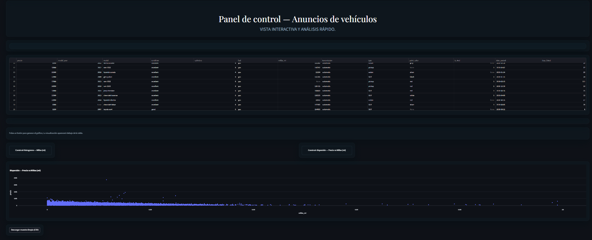

<h1 style="color:#0969da; font-size:36px; margin-bottom:0;">
Carlos Orlando Meneses Corona
</h1>

<b>Data Analyst Jr | Technical Operations | SQL · Python · BI</b>

Analista de Datos con formación en Ingeniería TIC y experiencia en análisis de datos,
automatización, SQL, BI y procesos operativos.

## Proyectos

Web Scraping & Deploy

Descripción del proyecto
Desarrollé un pipeline de extracción automática de datos desde una fuente HTML pública para generar un dataset limpio y listo para análisis. El objetivo fue transformar datos no estructurados en información accesible y reutilizable mediante un proceso reproducible y desplegado en la nube.

Qué hice

Extracción de datos HTML usando Requests y BeautifulSoup.

Limpieza y estructuración del dataset con Python.

Generación de visualizaciones básicas para exploración inicial.

Despliegue de la solución como aplicación web ligera para consulta de resultados.

Tecnologías utilizadas

Python

Requests

BeautifulSoup

Pandas

Matplotlib

Git

Render (deploy en la nube)

Resultado / impacto

Automatización de la obtención de datos sin intervención manual.

Dataset reutilizable para análisis posteriores.

Disponibilidad pública del proceso mediante una app desplegada.

Aprendizajes clave

Manejo de datos no estructurados desde HTML.

Construcción de pipelines simples de datos (extracción → limpieza → salida).

Flujo completo de desarrollo y despliegue (código versionado + app online).

Evidencia y código

Repositorio del proyecto:
https://github.com/OrlandoCorona/App_Web_Streamlit

---

## Sistema Web “El Arca” – Gestión Operativa e Inventarios

Proyecto de refactor y profesionalización de un sistema interno para la operación de un restaurante real.  
El objetivo fue pasar de un conjunto de archivos HTML + XAMPP sin estructura a una aplicación modular con base de datos relacional y despliegue controlado.

### Problema a resolver
La operación diaria (reservas, consumo, inventarios y compras) se llevaba con procesos manuales y archivos sueltos, lo que generaba:
- inconsistencias en inventarios  
- poca trazabilidad de ventas y consumo  
- dependencia de hojas de cálculo y registros manuales  

### Solución implementada
- Diseño de una base de datos relacional para centralizar la información operativa.
- Migración de MySQL a PostgreSQL para mejorar integridad y consultas complejas.
- Refactor completo del backend en PHP con estructura modular.
- Separación clara entre lógica de negocio, vistas y acceso a datos.
- Preparación de entorno de despliegue con Docker y pruebas en Render.

### Funcionalidades clave
- Registro de ventas y consumo
- Control básico de inventarios
- Módulo de reservas
- Consultas SQL para análisis operativo (consumo, rotación, compras)

### Impacto
- Mejor planeación de compras basada en datos reales de consumo.
- Reducción de errores manuales en inventarios.
- Base técnica preparada para futuros análisis y dashboards.

### Tecnologías utilizadas
PHP · PostgreSQL · SQL · Docker · Render · Git · HTML · CSS

### Evidencias

  

  

### Código fuente
👉 https://github.com/OrlandoCorona/ElArca-System

### 📊 Zuber — Movilidad & Estadística

Análisis de datos de movilidad urbana para identificar si las condiciones climáticas influyen en la duración de los viajes.

Se construyó un pipeline de análisis desde la extracción de datos con SQL hasta la validación estadística en Python, permitiendo evaluar hipótesis y detectar patrones de comportamiento en la demanda de viajes.

**¿Qué hice?**
- Extracción y unión de datos con consultas SQL (JOIN, CASE, agregaciones).
- Limpieza y preparación de datos en Python (Pandas).
- Análisis exploratorio y visualización de tendencias.
- Pruebas estadísticas para validar hipótesis sobre clima vs duración de viajes.

**Tecnologías usadas**
- SQL
- Python (Pandas, SciPy, Matplotlib)
- Jupyter Notebook

**Resultado**
Se identificaron diferencias significativas en la duración promedio de los viajes bajo ciertas condiciones climáticas, mostrando cómo factores externos impactan el comportamiento del usuario y pueden influir en decisiones operativas y de pricing.

### Evidencias

  

  

📁 Código y análisis completo:  
👉 https://github.com/OrlandoCorona/Zuber-Data-Analysis

## 🧰 Tecnologías
Python · SQL · PostgreSQL · Power BI · ETL · Web Scraping · Git · Docker

---

## 📬 Contacto
- LinkedIn: https://www.linkedin.com/in/carlos-orlando-meneses-corona-da/
- GitHub: https://github.com/OrlandoCorona
- Email: menesescoronacarlosorlando@gmail.com
