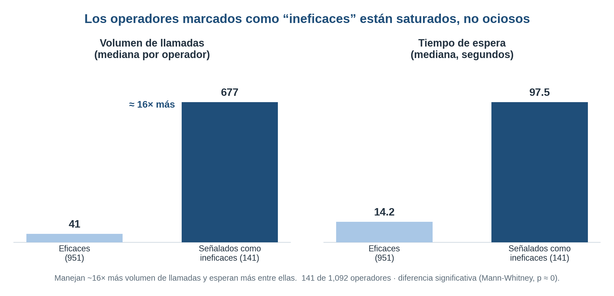
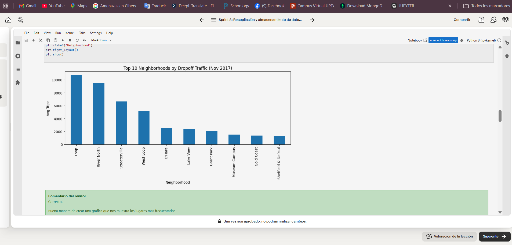
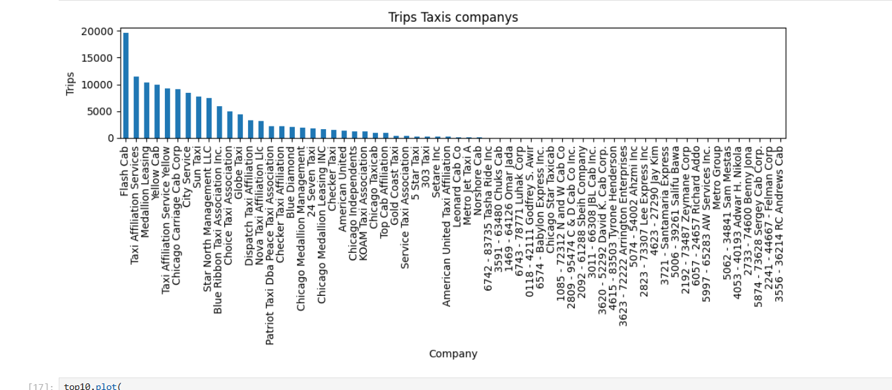
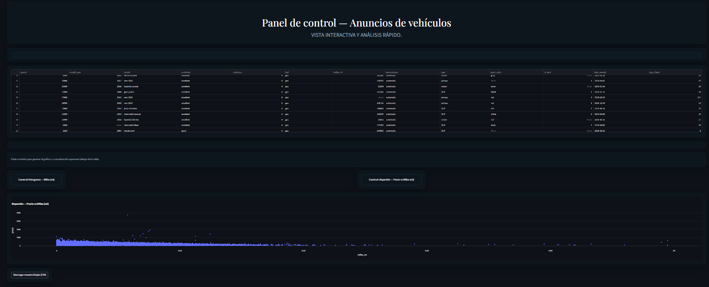
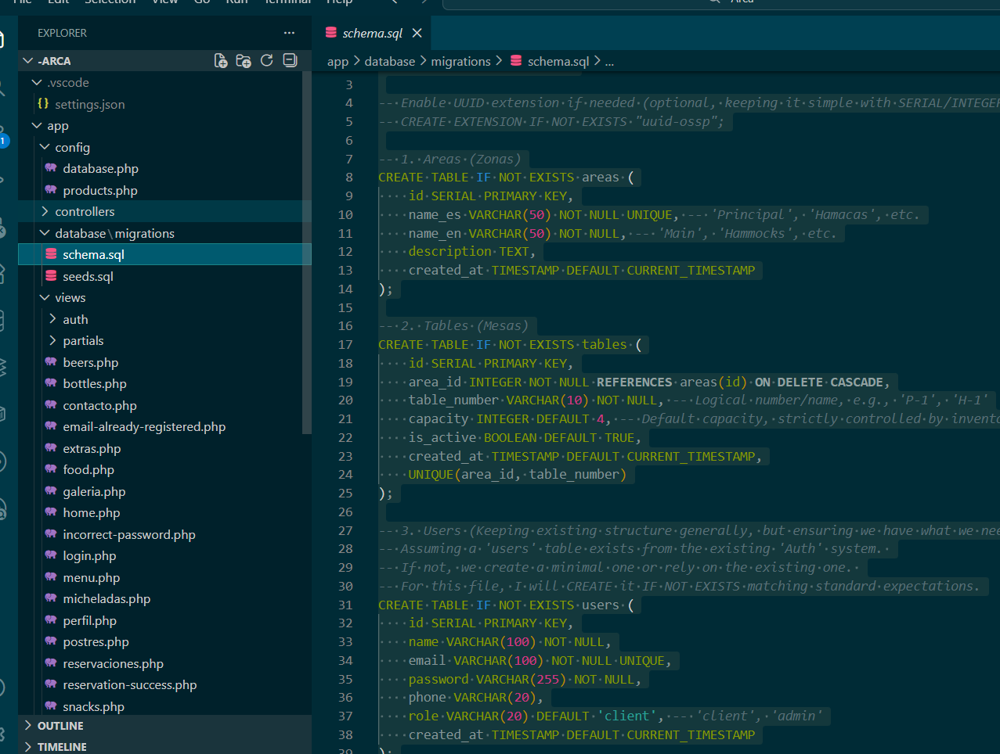

  

<!-- Foto de perfil centrada. Se usa images/Foto_Perfil_COMC.png (headshot profesional ya incluido en el repo). -->

  

Analista de datos con formación en Ingeniería TIC. Convierto datos en decisiones: 
SQL, limpieza y análisis con Python, pruebas de hipótesis, ETL y dashboards interactivos.

## **Proyectos**

### **1. CallMeMaybe — Detección de operadores ineficientes (Proyecto Final · Python + Estadística + Tableau)**

Proyecto final del bootcamp. Analicé el desempeño de los operadores de un servicio de telefonía virtual (call center) para identificar, con criterios objetivos, a los menos eficientes.

**Qué hice**
- Limpieza y preparación de los datos de llamadas (duplicados, tipos de dato y cálculo del tiempo de espera).
- Métricas por operador (llamadas perdidas, tiempo de espera y volumen) y detección de 141 operadores ineficientes de ~1,092 usando percentiles.
- Prueba de hipótesis (Mann-Whitney) para comparar el volumen de llamadas entre operadores eficientes e ineficientes.
- 2 dashboards en Tableau Public y una presentación ejecutiva.

**Tecnologías utilizadas**  
Python (Pandas, SciPy) · Estadística (Mann-Whitney) · Tableau Public · Google Colab

**Resultado**
El valor p ≈ 0 reveló un hallazgo clave: los operadores señalados en realidad atienden muchas más llamadas. No son ineficientes, están saturados. Con eso, la recomendación pasó de "sancionar operadores" a "redistribuir la carga".

  

**Dashboards en vivo (Tableau Public)**
- Dashboard 1: https://public.tableau.com/app/profile/carlos.orlando.meneses.corona/viz/CallMeMaybe-Operadoresineficaces/Dashboard1
- Dashboard 2: https://public.tableau.com/app/profile/carlos.orlando.meneses.corona/viz/CallMeMaybe-Operadoresineficaces/Dashboard2

  

**Código y análisis completo**  
https://github.com/OrlandoCorona/callmemaybe-operators-analysis

---

### **2. Binance Crypto ETL Pipeline (ETL + PostgreSQL + Power BI)**

Pipeline de datos de extremo a extremo que ingesta precios históricos de criptomonedas desde Binance, los valida y almacena en **PostgreSQL**, y presenta los resultados de estrategias cuantitativas en un **dashboard ejecutivo de Power BI**.

**Qué hice**
- **Ingesta** de datos OHLCV y almacenamiento en formato Parquet.
- **Validación** (integridad OHLC, huecos, valores atípicos) y **transformación** (retornos, volatilidad, regímenes).
- **Carga** a PostgreSQL y modelo de KPIs para Power BI.
- **Backtesting walk-forward** con validación estadística **Monte Carlo** (N=5,000 permutaciones).

**Tecnologías utilizadas**  
Python (Pandas, NumPy) · SQL · PostgreSQL · Power BI · Parquet · Git

**Resultado**
La estrategia principal (*H4 — Avoid Thursday*) alcanzó el **percentil 99.3 %** frente a operaciones al azar de igual exposición, superando al *buy & hold* en 4 de 4 activos.

  

  

**Código y análisis completo**  
https://github.com/OrlandoCorona/binance-crypto-pipeline

---

### **3. Análisis de viajes en taxi — Chicago (SQL + Estadística)**

Análisis de movilidad urbana para evaluar si las condiciones climáticas influyen en la duración de los viajes.

**Qué hice**
- Extracción y unión de datos con consultas **SQL**.
- Limpieza y preparación de datos con Pandas.
- Análisis exploratorio de la demanda por compañía y por barrio.
- Prueba de hipótesis (t de Welch) para validar el efecto del clima.

**Tecnologías utilizadas**  
SQL · Python (Pandas, SciPy, Matplotlib) · Jupyter Notebook

**Resultado**
La prueba estadística mostró diferencias significativas (p < 0.05): los días de mal clima presentan trayectos más largos.

  

  

**Código y análisis completo**  
https://github.com/OrlandoCorona/chicago-rideshare-sql-analysis

---

### **4. Análisis de ingresos de telecomunicaciones (Megaline)**

Comparación de los planes prepago Surf y Ultimate (500 usuarios) para orientar la inversión publicitaria.

**Qué hice**
- Ingeniería de ingresos: ingreso mensual por usuario (cuota + excedentes).
- Estadística descriptiva por plan y visualización de distribuciones.
- Prueba t de Welch para comparar los ingresos promedio.

**Tecnologías utilizadas**  
Python (Pandas, NumPy, SciPy) · Jupyter Notebook

**Resultado**
**Ultimate genera ~20 % más de ingreso por usuario** ($72.24 vs $60.33) con una varianza 25× menor (t = −8.23, p ≈ 0).

**Código y análisis completo**  
https://github.com/OrlandoCorona/megaline-telecom-revenue-analysis

---

### **5. Dashboard de anuncios de autos (Streamlit + Plotly)**

Aplicación web interactiva para explorar un dataset de anuncios de venta de autos.

**Qué hice**
- EDA del dataset (precio, kilometraje, año) en un notebook.
- App con **Streamlit** y gráficos interactivos con **Plotly**.
- Despliegue en la nube (Render).

**Tecnologías utilizadas**  
Python · Streamlit · Plotly · Pandas · Render

  

**App en vivo:** https://proyecto-sprint7-zsy8.onrender.com/  
**Código fuente:** https://github.com/OrlandoCorona/vehicle-ads-dashboard

---

### **6. Análisis del mercado de videojuegos**

EDA de ~16 000 títulos (1980-2016) para identificar plataformas y géneros con mayor potencial comercial.

**Qué hice**
- Limpieza del dataset y métrica de ventas totales.
- Análisis de plataformas, géneros y preferencias por región (NA, EU, JP).
- Correlación entre reseñas y ventas; pruebas de hipótesis.

**Tecnologías utilizadas**  
Python (Pandas, NumPy, SciPy, Matplotlib, Seaborn) · Jupyter Notebook

**Resultado**
PS4 y Xbox One son las plataformas más prometedoras; las reseñas de críticos predicen mejor las ventas (r≈0.40) que las de usuarios (r≈0.10).

**Código y análisis completo**  
https://github.com/OrlandoCorona/videogame-sales-analysis

---

### **7. Sistema Web "El Arca" — Gestión Operativa**

Refactor y profesionalización de un sistema interno para la operación de un restaurante real.

**Solución implementada**
- Base de datos relacional (migración MySQL → PostgreSQL).
- Backend en PHP con estructura modular (MVC).
- Autenticación, reservas, catálogo de menú y gestión de contactos.
- Despliegue con Docker en la nube (Render).

**Tecnologías utilizadas**  
PHP 8.2 · PostgreSQL · SQL · Docker · Render · Git · HTML · CSS

  

  

**App en vivo:** https://arca-jv4f.onrender.com  
**Código fuente:** https://github.com/OrlandoCorona/el-arca-restaurant-system

---

## **Tecnologías**

Python · SQL · PostgreSQL · Power BI · Tableau · Streamlit · Plotly · ETL · Docker · Git

---

## **Contacto**

LinkedIn — https://www.linkedin.com/in/carlos-orlando-meneses-corona-da/  
GitHub — https://github.com/OrlandoCorona  
Email — menesescoronacarlosorlando@gmail.com
